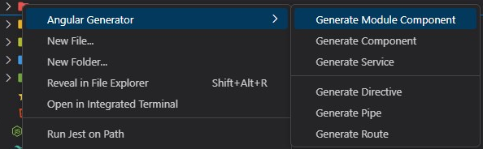
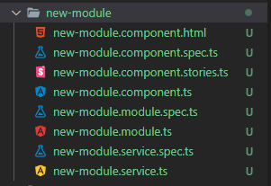

# Angular File Generator VSCode Extension

VSCode Extension to generate boilerplate files for Angular Modules, Components, etc...

## Features





- Right click in the explorer
- Select "Angular Generator"
- Select what you want to generate
  - Component generates html, spec, stories and ts
  - Service generates ts and spec
  - Module Component generates module ts, spec and everything component does
- Type in `dash-case` name

### Custom Templates
In `.vscode/settings.json` add in the following settings to customize the extension
```json
"angular-files-generator": {
    "customTemplateFolder": null
  },
```
`customTemplateFolder` - path relative you your workspace root, null will use the extension defaults

* See the [default templates](https://github.com/deniszholob/angular-files-generator/tree/main/src/templates) for reference.
* Naming should be`__name__.KEYWORD.EXTENSION.mustache` where KEYWORD is one of component, module or service. EXTENSION should reflect the file type and subtype, such as `spec.ts` for typescript tests.
* [Available variables](./src/generator/TemplateVariables.model.ts) examples
  * `{{componentPrefix}}` - app
  * `{{dashCaseName}}` - new-module
  * `{{upperCamelCaseName}}` - NewModule
  * `{{constantCaseName}}` - NEW_MODULE
  * `{{upperReadableName}}` - New Module

## Requirements

Generator creates the files from custom templates, so nothing is needed to create the files.
To use the files install

- [Angular](https://angular.io/docs)
- [Jest](https://jestjs.io/docs/testing-frameworks)
- [Storybook](https://storybook.js.org/docs/angular/get-started/introduction)

## Known Issues

https://github.com/deniszholob/angular-files-generator/issues

## Release Notes

https://github.com/deniszholob/angular-files-generator/releases

## Dev
[Extension Development Quick Start](./vsc-extension-quickstart.md)
[VsCode First Extension Doc](https://code.visualstudio.com/api/get-started/your-first-extension)
[VsCode API](https://code.visualstudio.com/api/references/vscode-api)

# Support Me

If you find the extension or the source code useful, consider:

- Donating on Ko-fi: https://ko-fi.com/deniszholob
- Donating on Patreon: https://www.patreon.com/deniszholob

# Downloads

- [Github](https://github.com/deniszholob/angular-files-generator/releases)
- [VSCode Marketplace](https://marketplace.visualstudio.com/items?itemName=deniszholob.angular-files-generator)
