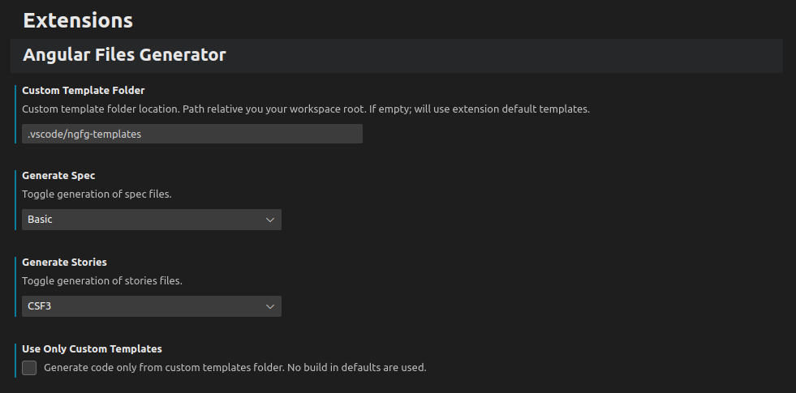

# Angular File Generator VSCode Extension

VSCode Extension to generate boilerplate files for Angular Modules, Components, etc...

Why use it? **Customization** to fit your needs!

While the default ng or nx generator is great, this allows you to customize your new generated files to fit your workflow without having to delete or add repetitively to the generated files.

## Support Me

If you find the extension or the source code useful, consider:

- Donating on Ko-fi: https://ko-fi.com/deniszholob
- Donating on Patreon: https://www.patreon.com/deniszholob

## Features

- Right click in the explorer  
  
- Select "Angular Generator"
- Select what you want to generate
  - Component generates html, spec, stories and ts
  - Service generates ts and spec
  - Module Component generates module ts, spec and everything component does
- Type in `dash-case` name  
  
- New files will be generated. You can right click into the folder to generate more. No files will be overridden.  
  

## Extension Settings/Config
In `.vscode/settings.json` add in the following settings to customize the extension.

* `customTemplateFolder` - Custom template folder location. Path relative you your workspace root. If empty will use extension default templates.
* `generateSpec` - Spec (Test) files can be written using basic class declarations (more performant) or using the angular test bed (More features). If unit testing, basic test structure should do fine. Can also disable tests as well.
  * 0: Diabled
  * 1: Simple
  * 2: TestBed
* `generateStories` - Storybook 6 and earlier use [Component Story Format](https://storybook.js.org/blog/storybook-csf3-is-here/) 2, Storybook 7 uses CSF 3. Can disable stories as well.
  * 0: Disabled
  * 2: CSF2
  * 3: CSF3

Using the json file  
```json
  "angular-files-generator.customTemplateFolder": ".vscode/ngfg-templates",
  "angular-files-generator.generateSpec": 1,
  "angular-files-generator.generateStories": 3,
```
Using the UI  
  

## Custom Templates
* Set the `customTemplateFolder` config to your custom template folder.
* See the [default templates](https://github.com/deniszholob/angular-files-generator/tree/main/src/templates/standard) for reference.
* File naming should be`__name__.KEYWORD.EXTENSION.mustache` where KEYWORD is one of component, module or service. EXTENSION should reflect the file type and subtype, such as `spec.ts` for typescript tests.
* Additional files with `KEYWORD` will also be rendered.  
  Example: `__name__.component.scss.mustache` does not have a default template, but will be rendered if included in the user's custom template folder.
* [Available variables](./src/generator/TemplateVariables.model.ts) examples
  * `{{componentPrefix}}` - app
  * `{{dashCaseName}}` - new-module
  * `{{upperCamelCaseName}}` - NewModule
  * `{{constantCaseName}}` - NEW_MODULE
  * `{{upperReadableName}}` - New Module

> **Note:** Overrides to `component.ts` and `module.ts` files will take precedence over internal extension templates and will yield in files in `StandaloneComponent` and `ModuleComponent`to be the same as the `Component` and `Module` Commands respectively, which may or may not matter...  
> This should not be a problem unless using the override and creating a mix of new module and standalone components.

## Requirements

Generator creates the files from custom templates, so **nothing is needed to create** the files!  
However, to use the files install

- [Angular](https://angular.io/docs) for component code
- [Jest](https://jestjs.io/docs/testing-frameworks) for unit testing
- [Storybook](https://storybook.js.org/docs/angular/get-started/introduction) for visual tests/documentation
- [ng-mocks](https://ng-mocks.sudo.eu/) recommended for helping mock services, etc.. for jest or storybook

## Known Issues/Feature Requests

https://github.com/deniszholob/angular-files-generator/issues

## Downloads

- [Github](https://github.com/deniszholob/angular-files-generator/releases)
- [VSCode Marketplace](https://marketplace.visualstudio.com/items?itemName=deniszholob.angular-files-generator)
